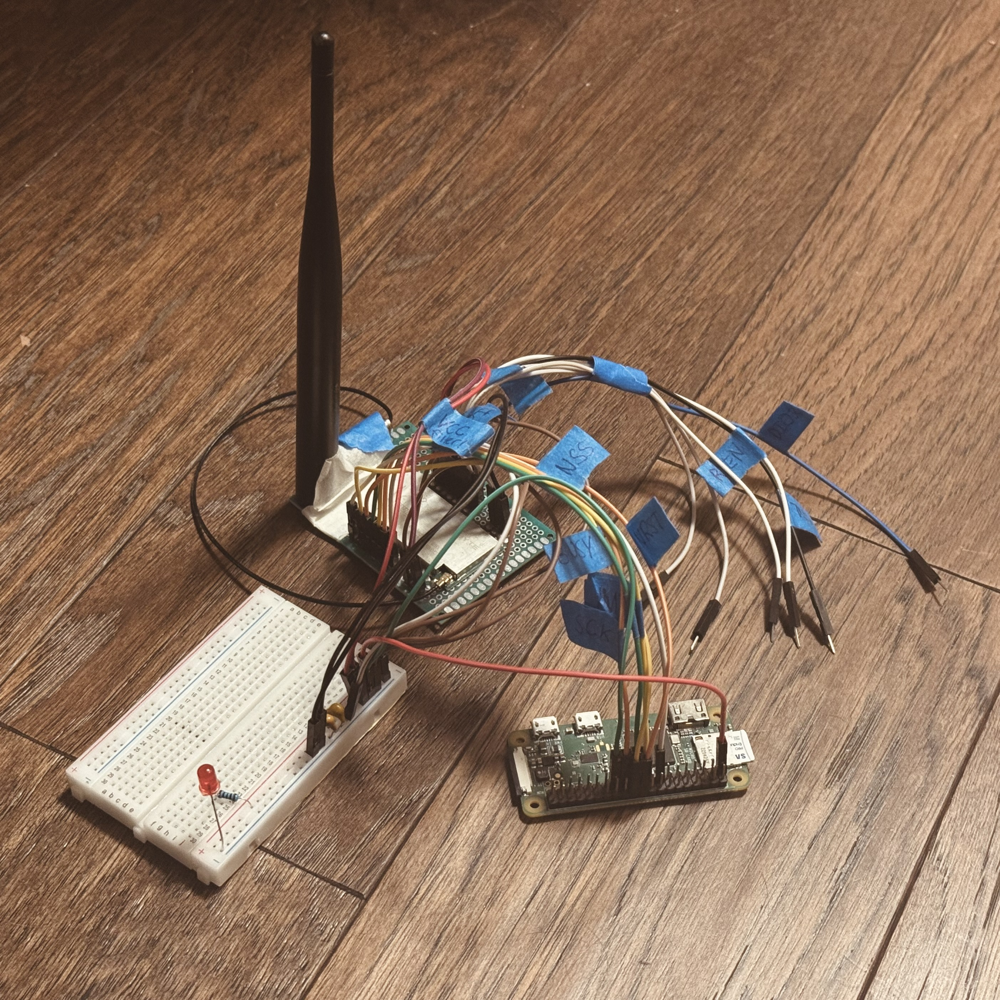

# rust radio experiments

this repository contains some old archived rust code written during 
early bring-up of LoRa radios (e22 series) on embedded linux. I 
eventually pivoted away from LoRa use, but wrote some nice async code
that would be easily expanded and fixed up should anyone wish to use
it. it ran sucessfully on a Pi CM4 and a Pi Zero W. one can cross compile to
that target with `cross`. you may need to make a custom docker image
to get cross to target `armv7-unknown-linux-gnueabihf`...

the primary hardware tested was the E22900M30S (SX126x-based LoRa
module) and some other E22's. this module is notable in that it 
allows for a full 1W (30dBm) of broadcast power, whilst most everything
else in the word limits you to 27 dBm) which allowed me to send
a message at 500 kHz bandwidth around ~30km (!!) in New Jersey with the antenna
on top of my roof. take care to know that this is the absolute maximum 
allowed on the U.S. ISM bands (and I believe Europe is much more
restrictive). you can use a max 6 dBi gain antenna (so 36 dB EIRP)
before someone probably comes and knocks on your door. and use FHSS!

# other information

this code is *not* production-ready (in fact please note the blocking
spi transfer in the middle of an otherwise pleasant async runtime!) 
and is preserved as a reference and because I didn't want to throw it away.

# the magnificent test setup

